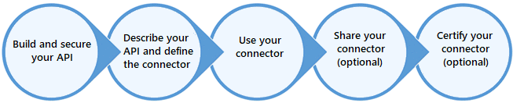

# Conector personalizado
Caso os conectores existentes não atendam a sua necessidade é possível criar um conector personalizado. Esse conector personalizado é um recurso do Azure e pode ser editado para trabalhar com uma API que utiliza definição OpenAPI (Swagger) ou também uma coleção do Postman.

Depois que essa configuração no conector for feita, você pode configurar detalhes gerais (como ícone do conector, descrição, protocolo, qual host e também qual a base da API) e também autenticação (que pode ser No Auth, Basic Auth, API Key e OAuth 2.0)

Você pode configurar Actions, Triggers e references no seu connector:
 * Onde `actions` seria uma operação a ser executada, como ler, criar, atualizar ou deletar um recurso dentro do conector.
 * Já `trigger` seria a leitura de um dado do conector onde o foco é o acontecimento de um evento.
 * E por último `reference` que é parametros reusados por actions e triggers

Você pode compartilhar esse conector com a Microsoft, mas nesse caso exsite um processo de validação.
Ciclo de vida de um conector personalizado:
___

