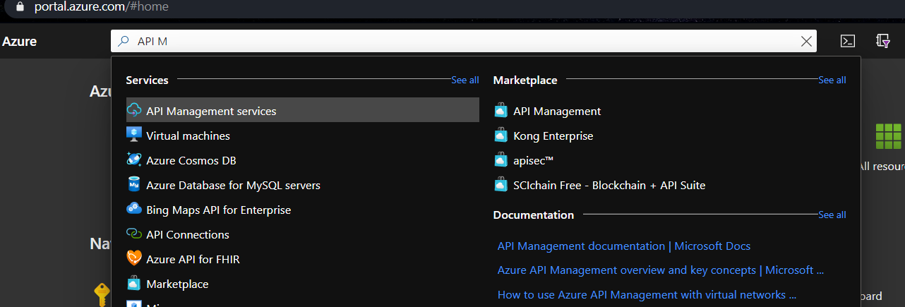

## Criação

O processo de criação de uma API Managment é simples e é um serviço pronto no Azure, você pode criar através do portal, az cli, powershell, template ARM. Esse processo demora para terminar, pois são criados vários recursos dentro do azure.

# Portal

Basta pesquisar por `API Managment Services` e clicar em adicionar.



Depois que preencher os dados básicos (que são obrigatórios) você ja pode criar o recurso.


Existem configurações adicionais que você pode ajustar no momento da criação ou depois que o ambiente já estiver criado.

# Azure CLI

Para criação atraves do Azure CLI, basta executar o seguintes comandos

```powershell
az group create --name your-rg --location your-location

az apim create --name your-apim-name --resource-group your-rg --location your-location --publisher-email your@mail.com --publisher-name Your-Company

```

# Powershell

Para criação atraves do powershell, basta executar o seguintes comandos

```powershell

New-AzResourceGroup -Name your-rg -Location your-location

New-AzApiManagement -Name "your-apim" -ResourceGroupName "your-rg" `
  -Location "your-location" -Organization "your-organization" -AdminEmail "your@mail.com" 
```